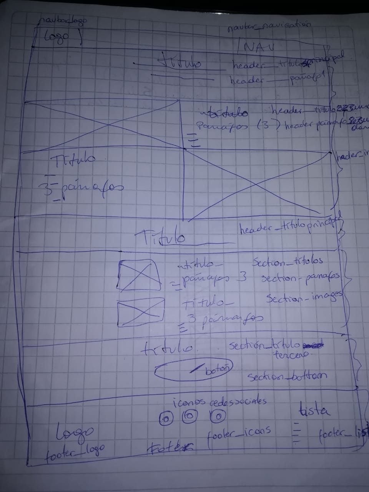

##Requisitos generales:
1. Mostrar a sus clientes una pequeña reseña sobre su historia 
2. La procedencia de sus productos 
3. Mostrar a las personas que trabajan cosechando estas verduras.
4. Ser responsiva
5. Mostrar la pasión que sienten por sus tomates
6. Dar enfásis a la compra de sus productos
7. Mostrar el logo de la empresa

##Requerimientos técnicos:

- Sitio web debe contener 6 secciones más el navbar y footer.

1. El logo y una barra de navegación 
2. Debe mostrar el producto en imágenes principales
3. Debe tener una sección "Nosotros"
4. Debe invitar a comprar tomates
5. Debe tener un footer con enlaces a redes sociales

- Se ultilizara herramientas de desarrollo:
1. Bootstrap 3.3.7
2. jquery version 3.3.1
3. Font Awesome 5
4. Google Fonts

##Requerimientos visuales:

1. Colores:
   -#E56353
   -#686963
   -#707070
   -#FAFAFA
   -#FFFFFF

2. Fuentes:
   -Raleway-Bold.ttf
   -Raleway-ExtraLight.ttf
   -OpenSans-Regular.ttf

3. Imagenes:
   - Proporcionadas por Diseñador de Mockup

##Sketch:   

Sketch Escritorio

Sketch Mobile

Descripción Layout:

Estructura HTML:

1. La estructura debe estar compuesta por :
   - 1 <nav></nav>
       - Contiene logo y menú de navegación

   - 1 <header></header>
       - Contiene título principal + imagen a la izquierda y parrafos a la derecha + parrafo a la izquierda e imagen a la derecha

   - 2 <section></section>
       - Primera seccion: título + 2 imagenes verticales y descripcion en cada una de ellas
       - Segunda seccion: título + botón

   - 1 <footer></footer>
       - Contiene logo a la izquierda + iconos a redes sociales al centro + lista con links a la derecha 

Clases CSS:

1. <nav>
	class= navbar
	class= nav__logo
	class= navbar__right
   </nav>

2. <header>
	class= header__tiatomate
	class= header__tituloprincipal
	class= header__primerparrafo
	class= header__titulosecundario
	Class= header__segundoparrafo
	class= header__images
   </header>

3. <section>
	class= section__titulos
	class= section__parrafos
	class= section__images
	class= section__titulotercero
	class= section__bottom
   </section>
4. <footer>
   	class= footer__logo
   	class= footer__icons
   	class= footer1__list
   </footer>

##Creación de directorios:

)

